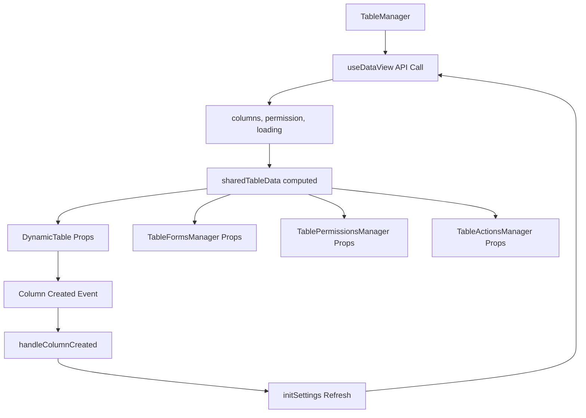

# TableManager Refactor Summary

## ✅ **Architecture Improvement**

Successfully moved `useDataView` from individual components to the centralized `TableManager` level, creating a more efficient and maintainable architecture.

## **Before vs After**

### **❌ Before (Inefficient)**
```
TableManager
├── Data Tab
│   └── DynamicTable (useDataView) ← Duplicate API call
├── Forms Tab  
│   └── TableFormsManager (useDataView) ← Duplicate API call
├── Permissions Tab
│   └── TablePermissionsManager (useDataView) ← Duplicate API call
└── Actions Tab
    └── TableActionsManager (useDataView) ← Duplicate API call
```

### **✅ After (Efficient)**
```
TableManager (useDataView) ← Single API call
├── Data Tab
│   └── DynamicTable (props: columns, permission, loading)
├── Forms Tab  
│   └── TableFormsManager (props: columns, permission, loading)
├── Permissions Tab
│   └── TablePermissionsManager (props: columns, permission, loading)
└── Actions Tab
    └── TableActionsManager (props: columns, permission, loading)
```

## **Key Changes**

### **1. TableManager.vue** ✅
- **Added**: Centralized `useDataView` call
- **Added**: `sharedTableData` computed property
- **Added**: Props passing to all child components
- **Added**: `handleColumnCreated` event handler

```typescript
// Centralized data fetching
const { columns, permission, loading, initSettings } = useDataView(props.tableName);

// Shared data for all tabs
const sharedTableData = computed(() => ({
  columns: columns.value,
  permission: permission.value,
  loading: loading.value,
  tableName: props.tableName,
  canManage: canManagePermissions.value
}));
```

### **2. DynamicTable.vue** ✅
- **Removed**: `useDataView` call
- **Added**: Props interface for receiving data
- **Added**: `columnCreated` event emission
- **Updated**: All references to use props instead of local data

```typescript
interface Props {
  columns: Column[];
  permission: any;
  loading: boolean;
  tableName: string;
}

// Emit events for parent component
const emit = defineEmits<{
  columnCreated: [];
}>();
```

### **3. Child Components** ✅
- **TableFormsManager.vue**: Updated to receive shared props
- **TablePermissionsManager.vue**: Updated to receive shared props  
- **TableActionsManager.vue**: Updated to receive shared props
- **Removed**: Individual `useDataView` calls

## **Benefits**

### **🚀 Performance**
- **Single API call** instead of 4 duplicate calls
- **Faster initial load** time
- **Reduced server load**
- **Better caching** efficiency

### **🔄 Data Consistency**
- **Single source of truth** for table metadata
- **Synchronized updates** across all tabs
- **No race conditions** between components
- **Consistent permission state**

### **🛠️ Maintainability**
- **Centralized data management**
- **Easier to debug** data flow
- **Simpler state updates**
- **Better separation of concerns**

### **📱 User Experience**
- **Instant tab switching** (data already loaded)
- **Consistent loading states**
- **Synchronized column updates**
- **Better error handling**

## **Usage**

### **Simple Usage**
```vue
<template>
  <!-- Single component handles everything -->
  <TableManager table-name="users" />
</template>
```

### **With Event Handling**
```vue
<template>
  <TableManager 
    table-name="products" 
    default-tab="forms"
    @tab-change="handleTabChange"
  />
</template>

<script setup>
const handleTabChange = (tabName) => {
  console.log('Active tab:', tabName);
};
</script>
```

## **Data Flow**



## **Event System**

### **Column Creation Flow**
1. User clicks "Add Column" in DynamicTable
2. CreateColumnDialog opens and creates column
3. DynamicTable emits `columnCreated` event
4. TableManager receives event and calls `initSettings()`
5. Fresh data is fetched and propagated to all tabs
6. All components update with new column data

## **API Calls Reduced**

### **Before**: 4+ API calls per table view
```
GET /companies/data/schema/{table_name}        ← DynamicTable
GET /companies/data/records/{table_name}/permissions ← DynamicTable
GET /companies/data/schema/{table_name}        ← TableFormsManager  
GET /companies/data/records/{table_name}/permissions ← TableFormsManager
GET /companies/data/schema/{table_name}        ← TablePermissionsManager
GET /companies/data/records/{table_name}/permissions ← TablePermissionsManager
```

### **After**: 2 API calls per table view
```
GET /companies/data/schema/{table_name}        ← TableManager (shared)
GET /companies/data/records/{table_name}/permissions ← TableManager (shared)
```

## **Migration Guide**

### **For Existing Usage**
Replace any direct usage of `DynamicTable` with `TableManager`:

```vue
<!-- Old -->
<DynamicTable :setting="{ table_name: 'users' }" />

<!-- New -->
<TableManager table-name="users" />
```

### **For Custom Implementations**
If you need to access the shared data directly:

```vue
<template>
  <TableManager 
    ref="tableManagerRef"
    table-name="products"
  />
</template>

<script setup>
const tableManagerRef = ref();

// Access shared data if needed
const getSharedData = () => {
  return tableManagerRef.value?.sharedTableData;
};
</script>
```

## **Future Enhancements**

This refactor sets the foundation for:
- **Global state management** integration
- **Real-time updates** via WebSocket
- **Caching strategies** implementation
- **Offline support** capabilities
- **Advanced permission** caching

The architecture is now much more scalable and efficient! 🎉
